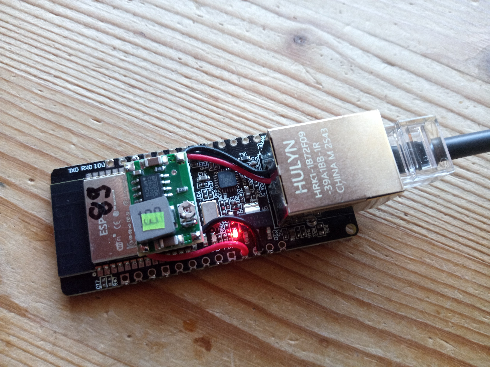
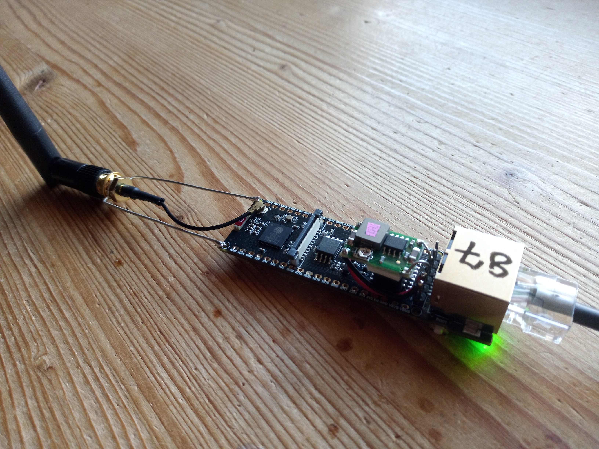

ultra-espnow-sniff
==================

work in progress... stay tuned

want to decode the capture on a Linux box, or sniff ESP-NOW with an ordinary Wi-Fi adapter instead? have a look at this: [espnow-sniff](https://github.com/sp4rkie/espnow-sniff)

what is it
----------

- an [ESP32](https://en.wikipedia.org/wiki/ESP32) in promiscuous mode that captures unencrypted ESP-NOW traffic and streams it out as an ordinary pcap
- the capture leaves either over the UART, for a bench unit on a USB cable, or over ethernet to a collector, so several of them spread through a building can be merged into one view
- ESP32 promiscuous mode **does** deliver ESP-NOW frames. a claim to the contrary is easy to find and is wrong

project main objective
---------------------

one receiver misses a few percent of the frames on the air, and *which* few depends entirely on where it sits. a device that looks deaf from one position answers perfectly from another, so a single sniffer cannot tell a broken link from a badly placed observer. several cheap collectors reporting to one machine settle it.

basic functionality
------------------

- `esp_wifi_set_promiscuous()` with the management filter, then reject everything that is not an ESP-NOW vendor action frame: category `0x7f`, OUI `18:fe:34`
- the promiscuous callback does nothing but that test and a copy into a FreeRTOS ring buffer, because it blocks the Wi-Fi task while it runs
- a writer task drains the ring and emits pcap: a global header, then one record per frame carrying rssi, channel, rate and length
- the pcap global header is re-emitted every few seconds, so a reader may join a stream already in progress

features
--------

- **one code path, two transports.** no collector address compiled in means pcap over the UART; giving one means ethernet plus TCP to that host
- **no address in the source.** the collector is a build time define and the PHY is chosen in the sdk config, so the same code serves the LAN8720 boards and the SPI W5500 ones
- **timestamps that survive a reconnect.** SNTP once, then a monotonic timer, so records stay ordered even while the clock settles
- **the counters reach the host in band.** the serial line carries nothing but pcap, so a health frame is emitted as a synthetic ESP-NOW frame from a locally administered address, and the decoder renders it as an ordinary readable line
- **updates over ethernet.** a soldered in collector is awkward to reach with a flasher, so it polls a firmware directory and updates itself. rollback is armed and is cancelled only once the capture demonstrably reaches the collector, which means an image that cannot stream is reverted rather than kept

what a frame identifies itself by
--------------------------------

the four bytes ESP-NOW carries after the OUI are constant across every retry of one transmission and change between transmissions. so `(source, sequence, those four bytes)` names a transmission without the collectors' clocks having to agree at all — which matters, because retries are about a millisecond apart and byte identical, far finer than any clock protocol resolves over a LAN.

required hardware
-----------------

- any ESP32 for the UART variant
- for the ethernet variant, a board with a PHY: the LAN8720 ones over the internal EMAC, or an SPI W5500

build environment
-----------------

- [ESP-IDF](https://github.com/espressif/esp-idf) v5.5 or later, and `$IDF_PATH` set
- CMake 4.0 or later: `CMakeLists.txt` asks for it, but ESP-IDF itself needs only 3.16, so the
  CMake it installs (3.30 with v5.5) or your system's may well be older - check `cmake --version`
- the ethernet variant pulls in the `ethernet_init` component shipped with the IDF ethernet examples,
  see `main/idf_component.yml`

how to build
------------

pcap over the UART at 921600:

    idf.py set-target esp32
    idf.py build flash monitor

pcap over ethernet to a collector:

    OPTS_='-DSNIFF_COLLECTOR="192.168.0.11"' idf.py build flash

the channel defaults to 6 and is a define like the rest:

    OPTS_='-DSNIFF_COLLECTOR="192.168.0.11" -DSNIFF_CHANNEL=11' idf.py build

`main/mcfg.h` as shipped is a template. real values belong in an `mcfg_local.h` beside it, pulled in by `MCFG_LOCAL`, so nothing private need ever be committed.

how to use it
-------------

point anything that reads pcap at it. over the UART, or over the network with the listener from the companion repo:

    espnow-collect -d /var/lib/espnow

then decode one collector, live:

    espnow-sniff -r /var/lib/espnow/espnow-192.168.0.11.pcap

or watch every collector at once, which is the point of running more than one:

    espnow-live /var/lib/espnow/*.pcap
